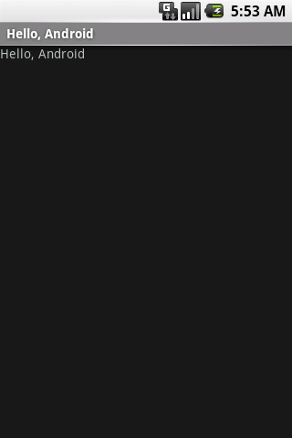

Android UI Patterns-Custom Title
================================

---

Android UI Patterns-Custom Title
================================

Certain Android Quirks require that one modify code to get a good designed
UI for an Android Application.  This set of slides concentrates on the
reasons for customizing the title bar and the techniques.

---

Slide #2
========

---

Slide #3
========

- Android UI Widgets use the default OS styles and colors.

- If you want to customize you have to understand some Window components
and some of the Android Application life-cycle.

---

Slide #4
========

Two Tasks to Accomplish

- Title bar a different color and customizations

- Get rid of title bar flash

---

Slide #5
========

Mobile Java and java Reflection Do Not Mix

- Slow on devices below 1GHZ even with JIT enabled

- Huge battery drain

Thus we avoid using java reflection to grab the drawable components of the
title bar and changing...

---

Slide #6
========

So How Do we customize the title bar without using java reflection?

- Use Window Extended features

---

Slide #7
========

---

Slide #8
========

Two layout files are used, one for content and one for the title layout

    !java
    requestWindowFeature(Window.FEATURE_CUSTOM_TITLE);
    setContentView(R.layout.main);
    getWindow().setFeatureInt(Window.FEATURE_CUSTOM_TITLE, R.layout.title);

---

Slide #9
========
By using a selector file in title layout you can have the imageview act as a
button..

    !xml
    <?xml version="1.0" encoding="utf-8"?>
       <RelativeLayout android:id="@+id/header"
          xmlns:android="http://schemas.android.com/apk/res/android"
          android:layout_height="wrap_content"
          android:layout_width="fill_parent"
          android:background="#066dc9">
       <ImageView android:src="@drawable/companylogo"
           android:layout_width="wrap_content"
           android:layout_alignParentLeft="true"
           android:layout_centerVertical="true"
           android:id="@+id/back"
           android:layout_height="wrap_content"
           android:layout_alignParentTop="true" />
       <TextView android:id="@+id/title"
           android:layout_width="wrap_content"
           android:gravity="center"
           android:textSize="20px"
           android:textColor="#ffffff"
           android:layout_alignParentRight="true"
           android:text="New Title"
           android:background="#335370"
           android:layout_height="wrap_content"
           android:layout_alignParentTop="true"
           android:padding="9dip"
           android:layout_margin="5dip" />
      </RelativeLayout>

---

Slide #10
========

    !xml
    <?xml version="1.0" encoding="utf-8"?>
       <selector xmlns:android="http://schemas.android.com/apk/res/android">

         <item android:state_pressed="false"
             android:drawable="@drawable/mobilebyteslogo_normal" />

         <item android:state_pressed="true"
            android:drawable="@drawable/mobilebyteslogo_pressed" />

      </selector>

and of course the events code in onCreate

    !java
    findViewById(R.id.back).setOnClickListener(new OnClickListener() {

            public void onClick(View v) {
                dispatchKeyEvent(new KeyEvent(KeyEvent.ACTION_DOWN,
                        KeyEvent.KEYCODE_BACK));
                dispatchKeyEvent(new KeyEvent(KeyEvent.ACTION_UP,
                        KeyEvent.KEYCODE_BACK));
            }
        });

---

Slide #11
========

Title text gets added in onCreate with

    !java
    ((TextView) findViewById(R.id.title)).setText("Custom Status Bar");

---

Slide #12
========

Do not forget the Theme that sets the Title width as since we are
using the Window Extended features we have to define a title width,
otherwise we will get a default title width...first the style
grabbing the default window background..

    !xml
    <?xml version="1.0" encoding="UTF-8"?>
        <resources>
          
        </resources>

Than our theme which we define in the sometimes in the application tag

    !xml
    <?xml version="1.0" encoding="utf-8"?>
       <resources>
         
      </resources>

---

Slide #13
========

- Using only default settings in application tag
 in AndroidManifest still gives a title bar flash, why?

---

Slide #14
========

- Using Default AndroidManifest settings applies the title bar
  default style theme before onCreate fully initializes, hence the
  title bar flash even though you have called

    requestWindowFeature(Window.FEATURE_NO_TITLE);

---

Slide #15
=========

So we setup a splash activity that posts a delayed intent request on a thread
and we set the androidManifest application tag to use this theme

    !xml
    <application android:icon="@drawable/andcustomtitleicon"
      android:label="@string/app_name"
        android:theme="@android:style/Theme.NoTitleBar">

---

Slide #16
=========

